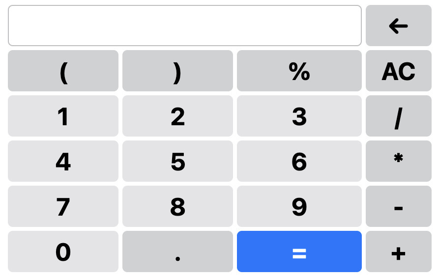

# Calculator Firefox Ext.

Description: A simple calculator browser extension. This extension provides an easy way to use a calculator app over the current browser tab, rather than changing tabs/windows.

### Try it out here - 

<iframe src="src/calculator/view.html"></iframe>

<!--  -->

**Version 1.0**

Features - 

1. Operations  - $+, -, /, *, \%$, AC (Clear) , ← (Backspace)
2. Throws error if invalid input.

Upcoming features (Version 1.1) - 

1. Keep track of recent calculations; Click to load and edit previous expressions; Clear history every $t$ minutes.
2. Implement % properly (same as google calculator or any calculator)
3. Parse expression properly (% and parenthesized expressions)
4. Implement following operations -
    1. Exponent $x^y$ and Root $\sqrt[x]{y}$
    2. Logarithm $\log_xy$
    3. Answer (use Ans as a variable)
    4. Trigonometric functions - $\sin$, $\cos$, $\tan$
    5. Factorial $x!$
